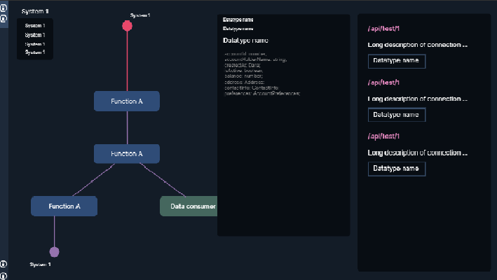
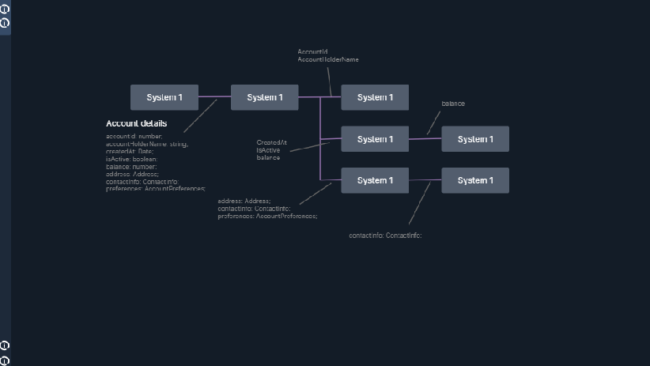
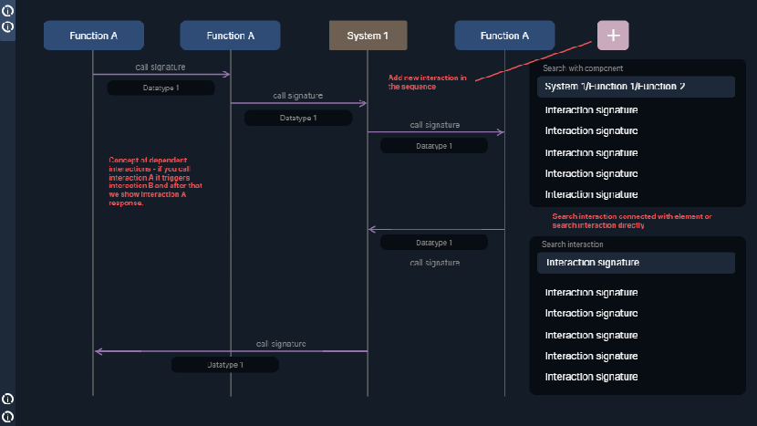

# SnowFinchShowcase


<br>**Showcase repository.**<br>**SnowFinch** – an application for designing complex systems with a focus on processes, their connections, and the flow of data between them.

# UI Examples

Structure schema

Data tracing

Data flow diagram


# Base theories

## IDEF0

Main entities:
- Process
- Input
- Output
- Controlling elements
- Mechanisms

## UML Data flow diagram

Interaction sequences

## G. Luger - Artificial Intelligence, 2003

### 5.3.3 Search control in production systems

**Input Data -> Target state**

Task is the search for the solution.
Start with input data as initial state.
Follow production rules to find target state - solution, use conflicts resolution strategy to choose the next rule.

Production rule = Condition -> Action

Compare current state with condition and apply action to change the state or add new rules.

**Target state -> Input data**

TODO: opposite process.

# Entities

- **Process** - describes some function/process.
    Gets input data, manipulates data, provides output back.
    <br>Сan be a wrapper over other connected Processes to abstract them.
    <br>Inherits all input connections from inner Processes.
- **Actor** - describes an entity that executes a number of Processes. All Processes, that the actor owns, answer the question "What does it do?".
    <br>Can consist of a number of Actors to depict some complex structures.
    <br>Inherits all input connections from inner Processes and Actors.
- **Call** - describes interaction between two Processes/Actors. Bears an input and an output.
- **Trigger** - describes causation between calls. Allows to organise a chain of calls.
    <br>Allows to make a decision about which call to trigger.
- **Flow** - indicates beginning of a consumer flow.
    <br>Design-related term.
    <br>indicates what interaction sequence a consumer should follow to use some complex functionality.
- **Route** - connects two calls.
    <br>Allows to trace a flow through all calls.
    <br>Allows to make a decision about which call to proceed with.
- **State** - accumulates some data, statements to define changable contexts for interactions in systems.
    <br>Allows to have snapshots of the contexts and trace transitions between them.
- **Action** - defines how a process changes States.

# Node properties

**All**
- **Labels** - array of strings.
    <br>It is needed to combine nodes into multiple groups.
- **Name**
- **Description**

**Process**
- **Actions and Calls** - some complex text.
    <br>Action - describes how an action changes according Actor states.

**Action**
- **Expression** - some complex text.
    <br>It is needed to describe how an action changes result state.
- **Condition** - some complex text.
    <br>It is needed to interrupt a graph path if current result state (summary of all states) doesn't meet this condition.

**Flow**
???

**Actor**
- **Condition** - some complex text.
    <br>It is needed to interrupt a graph path if current result state (summary of all states) doesn't meet this condition.

**State**
- **Definition** - some complex text.
    <br>It is needed to define changable contexts for interactions in systems.

**Call**
- **Input** - some complex text.
    <br>Describes structure of an asset, that is sent with the call.
- **Output** - some complex text.
    <br>Describes structure of an asset, that client receives back from the call.
- **Signature** - string.
    <br>Uniquely identifies the call, defines interface for a communication with the connected node.
- **Condition** - some complex text.
    <br>It is needed to interrupt a graph path if current result state (summary of all states) doesn't meet this condition.

**Trigger**
- **Condition** - some complex text.
    <br>Shows under which condition this trigger works.

**Call**, **Route**
- **Flow** -  array of strings.
    <br>It is needed to depict which flows this node relates to. Allows to follow flow path from the Flow node to the end.

**Route**
- **Directions** - some complex text.
    <br>As condition but defines which call route directs to.
    <br>Each direction must be associated with according outgoing relation, that is connected with the Route.

# Relation usages

```
(Actor)-[CONSISTS_OF]->(Actor)

(Actor)-[OWNS]->(Process)

(Process)-[CONSISTS_OF]->(Process)

(Process) or (Actor)-[SENDS]->(Call)

(Call)-[GOES_TO]->(Process) or (Actor) or (Flow)

(Flow)-[BEGINS_WITH]->(Route)

(Route)-[DIRECTS_TO]->(Call)

(Call)-[PROCEEDS_WITH]->(Route)

(Process) or (Actor)-[PULLS]->(Trigger)

(Trigger)-[STARTS]->(Call)

(State)-[DEFINES]->(Actor) or (Flow)

(Action)-[MODIFIES]->(State)

(Process)-[PRODUCES]-(Action)
```

# Computational relations

Action, Condition, Trigger.Pull, Route.Direction depend on State, Input, Output.
<br> Used data/statements must be presented at least in the dependencies.


# Flow traversal

## V2

Flow traverse algorithm:
- Visit Flow node
	- Compute the conditions and choose Call node
	- Visit Call node with input
		- Compute conditions to continue or stop the flow
	- Visit Process node
		- Compute conditions to continue or stop the flow
		- Visit Actor node
			- Compute conditions to continue or stop the flow
				- Recursively visit all parent Actors to compute the conditions
				...
		- Iterate Actions and Calls
			- Execute Action = Change all parent actor states
			- Visit Makes edge
				- Compute conditions to continue or stop the flow
				- Recursively visit Call node with input
				<br>...
			- Fill all parent Actor states with according Call node output
			<br>...
	- Fill Flow state with Call node output
- Visit Step node
	- Compute the conditions and choose Call node
	- Follow Observes edge and take processId -> Consumer
	- Visit Call node with processId to observe interaction
		- Compute conditions to continue or stop the flow
	- Visit Process node
		- Compute conditions to continue or stop the flow
		- Visit Actor node
			- Compute conditions to continue or stop the flow
				- Recursively visit all parent Actors to compute the conditions
				<br>...
		- Iterate Actions and Calls
			- Execute Action = Change all parent actor states (can other Actor states be changed?)
			- Visit Makes edge
				- Compute conditions to continue or stop the flow
				- Recursively visit Call node with input
				<br>...
			- Fill all parent Actor states with according Call node output
			<br>...
	- Fill Consumer state with Call node output
- Visit Step node
<br>etc...

## V1

```
- (Flow).(State).1 = (Context State) + (Actor 0).(State) + (Actor 0).Parent.(State) + ...
  InitialState = (Flow).(State).1 + (Actor).(State).1 + (Actor).Parent.(State).1
  ...
Repeat:
  - Visit (Call|Flow).(Route)
  - Compute (Route).(Condition)s
      with (State)s
  - Compute (Route).[Direction]s
      with (State)s
  - Visit (Call)
  - Compute (Call).(Condition)s
      with (State)s
  - Visit (Process)
    # If actor gets input, it is new actor state = actor with input, parent with input and etc.
  - (Process).(Actor).(State).N + (Call).[Input] = (Process).(Actor).(State)."N + 1"
    (Process).(Actor).Parent.(State).N + (Call).[Input] = (Process).(Actor).Parent.(State)."N + 1"
    ...
  - Compute (Process).(Condition)s,
    (Actor).(Condition)s,
    (Actor).Parent.(Condition)s
    ...
      with (State)s
  - Compute (Process).(Trigger).(Pull)s
      with (State)s
    Recursive:
      - Visit (Call)
        ...
    # If actor gets output, it is new actor state = actor with output, parent with input and etc.
  - (Process).(Actor).(State)."N + 1" + (Process).(Trigger).(Call).[Output] = (Process).(Actor).(State)."N + 2"
    (Process).(Actor).Parent.(State)."N + 1" + (Process).(Trigger).(Call).[Output] = (Process).(Actor).Parent.(State)."N + 2"
    ...
  - Compute (Process).(Action)s
        with (State)s
  - (Flow).(State)."N" + (Process).(Action) = (Flow).(State)."N + 1"
    (Actor).(State)."N + 2" + (Process).(Action) = (Actor).(State)."N + 3"
    (Actor).Parent.(State)."N + 2" + (Process).(Action) = (Actor).Parent.(State)."N + 3"
    ...
  - (Flow).(State)."N + 1" + (Call).[Output] = (Flow).(State)."N + 2"
- Inspect FinalState = (Flow).(State).Final + (Actor).(State).Final + (Actor).Parent.Final + ...
```

# Alternative solutions

- **EDR Microsoft**
	- https://www.microsoft.com/en-us/security/business/security-101/what-is-edr-endpoint-detection-response
- **Celonis**
	- 
- **Node-RED**
	- Doesn't look like application for complex systems.
	  Does it allow to traverse some flows keeping authentication state?
- **MATLAB/Simulink**
	- 
- **Enterprise Architect by Sparx Systems**
	- 
- **Apache Nifi**
	- https://www.youtube.com/watch?v=TMGxkKNbHS8&list=PLkp40uss1kSI66DA_aDCfx02gXipoRQHc&index=2
- **GraphQL Playground/Hasura**
	- 